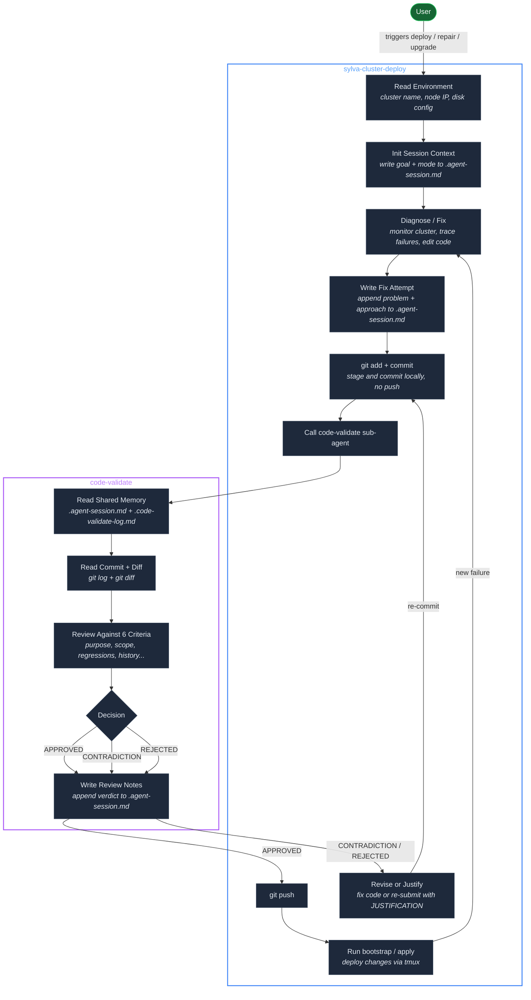
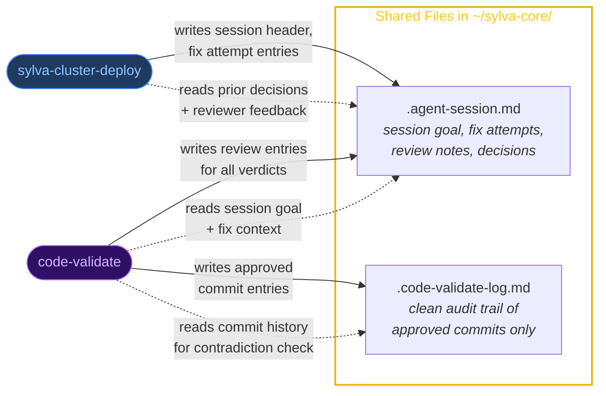
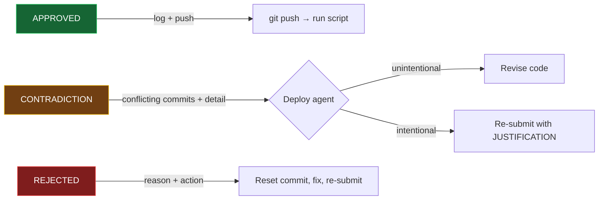

# Agentic Architecture

Two-agent system for deploying and validating code changes on Sylva OKD management clusters.

## Workflow

### Shared Memory

### Decision Outcomes

## Agents

| Agent | Role | Skill file |
|-------|------|------------|
| **sylva-cluster-deploy** | Deploys, diagnoses, and fixes cluster issues. Commits locally and requests validation before pushing. | `sylva-cluster-deploy/SKILL.md` |
| **code-validate** | Gate-keeper that reviews every commit before push. Returns APPROVED, CONTRADICTION, or REJECTED. | `code-validate/SKILL.md` |

## Shared Memory

Both agents read and write shared files in `~/sylva-core/`:

| File | Purpose | Deploy writes | Validate writes |
|------|---------|---------------|-----------------|
| `.agent-session.md` | Session goal, fix attempts, review notes, decisions | Session header, fix attempt entries | Review entries (all verdicts with reasoning) |
| `.code-validate-log.md` | Clean audit trail of approved commits | — | Approved commit entries only |

## Review Criteria

The code-validate agent evaluates each commit against:

| # | Check | Question |
|---|-------|----------|
| 1 | Purpose alignment | Does every changed file relate to the stated issue? |
| 2 | Completeness | Does the change fully address the issue? |
| 3 | Scope limitation | Are there unrelated modifications (scope creep, debug leftovers)? |
| 4 | No regressions | Could the change break an existing unit or deployment step? |
| 5 | Commit message | Does the message accurately describe the change? |
| 6 | History consistency | Does this conflict with or revert a previous fix? |

## Decision Outcomes

**APPROVED** — Change is correct and scoped. Logged to audit trail. Deploy agent pushes and runs bootstrap/apply.

**CONTRADICTION** — Conflicts with a prior approved fix. Deploy agent either:
- **Revises** the code to avoid the conflict, or
- **Re-submits** with a `JUSTIFICATION:` explaining why the contradiction is necessary

**REJECTED** — Change has issues. Deploy agent resets the commit, fixes the code, and re-submits.

## Retry Loop

After a successful push and script run, the deploy agent resumes monitoring the cluster. If a new failure appears, it loops back through diagnosis → fix → commit → validation until all Sylva units report ready.
